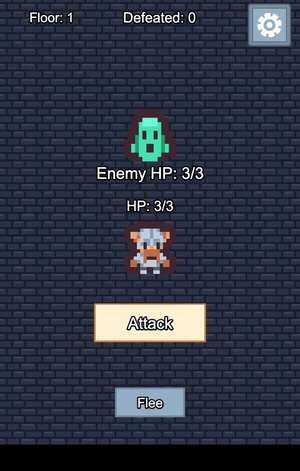

# coir × copse — catch UI that's *wired but unreachable*

[](https://github.com/aaronhg/coir-copse-demo/actions/workflows/ci.yml)
 · **▶ [Live demo](https://aaronhg.github.io/coir-copse-demo/)**
 · **[How it was built](DEVELOPMENT.md)**

**The question neither a static analyzer nor a UI test can answer alone:**
*you wired a button in the editor — can a player actually reach it in the shipped build?*

- **coir** reads the Cocos scene on disk → it knows a button is **wired** (its `clickEvents`
  link a node to a handler), but it never runs the game.
- **copse** drives the live canvas → it knows what's **reachable & pressable right now**, but
  not what the editor *should* have wired.

Join them on `(nodePath, method)` and you get the verdict neither has on its own:

| coir: wired? | copse: reachable? | verdict |
|:---:|:---:|---|
| ✔ | ✔ | **covered** |
| ✔ | blocked / not in this scene | ⚠️ **wired-but-unreachable** — a real defect |
| — | pressable, no serialized handler | 💀 **dead button** |

**The trick:** the join key `(nodePath, method)` **survives release minification** — a release
build mangles the handler's component class to `t`/`e`, but the method name is a serialized
string and coir still has the real names. So the correlation holds on a *shipped, minified*
build, not just a dev one.

This repo is the **proof**: a real Cocos Creator 3.8 game with four UI bugs deliberately
planted, and a CI gate that catches every one. Here's what the gate prints:

```text
 wired (coir) : 4      covered : 2      unreached : 2
   ·  [dead-button] Canvas/FleeBtn::null
 ✓ matches expected.json — no regression
```

**Run it yourself:** the **[live demo](https://aaronhg.github.io/coir-copse-demo/)** ships this
same suite as an in-page **▶ Run the suite** button — it drives the game in *your* browser (copse's
in-page engine, no backend) and shows the pass/fail + coverage verdict live.



> The game itself: tap **Attack** to trade blows; slay a monster and a tougher one fades in;
> take too many counter-hits and you fall. The ⚙ opens a settings strip. (Several monster and
> hero sprites cycle.)

## The four buried bugs

| # | Bug | How a UI gate catches it |
|---|-----|--------------------------|
| 1 | The menu's **✕ close button is disabled** (left `interactable:false`) | coverage → `blocked` when the menu is open |
| 2 | The **Flee button has no handler wired** | coverage → `codeOnly` (looks like a button, does nothing) |
| 3 | The **floor label never refreshes** — shown depth desyncs from the real floor | cross-check: shown value vs. game state |
| 4 | On death the **"Defeated" tally isn't reset** for the new run | reset-flow: drive to death, assert state |

The player's own HP and the enemy's HP are always correct — the bugs live in the shell
(a disabled button, an unwired button, a stale label, a missed reset), which is exactly the
class of defect a coverage gate is meant to surface.

## The suite — watch it catch them

The flow tests are plain JSON that copse's own runner (`copse run <dir>`) drives. Every step
carries its intent *and* its assertion, so a test reads like a description of what should happen:

```jsonc
// ci/tests/1-green-combat.json — drive a clean win, assert the core loop
{ "op":"patch", "sel":"Canvas/Game:DungeonGame.rollCounter", "hooks":{"replace":"()=>false"} }, // pin RNG: no counter
{ "op":"press", "ref":"Canvas/AttackBtn" },                                     // ×3 → slay the floor-1 monster
{ "op":"get", "sel":"Canvas/Game:DungeonGame.hp",      "expect":{ "value":3 } }, // took no damage
{ "op":"get", "sel":"Canvas/Game:DungeonGame.kills",   "expect":{ "value":1 } }, // one kill
{ "op":"get", "sel":"Canvas/Game:DungeonGame.enemyHp", "expect":{ "value":3 } }  // a fresh monster appeared
```

Each buried bug also gets a **tripwire** — a test that asserts the bug *still exists*:

```jsonc
// ci/tests/4-menu-close-disabled-tripwire.json — bug #1
{ "op":"eval",
  "expr":"cc.find('Canvas/MenuPanel/CloseBtn').getComponent(cc.Button).interactable",
  "expect":{ "value":false } }   // asserts the ✕ is STILL disabled → flips RED the day it's fixed
```

So the suite is green today and turns **red the moment someone fixes a bug** — the fixture
can't silently rot into correctness. Every push runs it headless:

```text
pass  1-green-combat            (12 steps)
pass  2-floor-desync-tripwire   (10 steps)
pass  3-defeat-keeps-tally…     (12 steps)
pass  4-menu-close-disabled…    ( 3 steps)
4/4 scripts passed   ·   coverage: 2 covered, 1 dead-button   ·   JUnit 37/37
```

## Run it

- **Play it now** — the **[live demo](https://aaronhg.github.io/coir-copse-demo/)** (the exact
  build CI publishes on every green push to `main`).
- **In the editor** — open the project in **Cocos Creator 3.8.6**, open
  `assets/scene/fixture.scene`, press **Preview** ▶ (it's the only scene).

`assets/scripts/DungeonGame.ts` is the whole game (one component); the RNG hooks
`rollCounter`/`rollDescend`/`rollMiss` are separate methods on purpose, so a driver can pin them
for deterministic tests.

## CI

An **editor-less** gate: `coir clickmap` (static) × `copse coverage` (live), diffed against a
committed baseline (`expected.json`), plus the flow suite and a selftest that proves the gate can
go red — all headless on GitHub Actions, which then publishes the passing build to Pages.

**→ [docs/CI.md](docs/CI.md)** for the mechanics, the runner recipe (why it needs a software
Vulkan device + a boot diagnostic), and running it locally.

## Assets & license

All art is CC0 by **[Kenney](https://kenney.nl)** — Tiny Dungeon · UI Pack · Pixel Adventure ·
Game Icons — byte-verified by md5; no other engine assets or sample content are bundled. Code
(`DungeonGame.ts`) is MIT. See [LICENSE](LICENSE).

## Docs

- **[DEVELOPMENT.md](DEVELOPMENT.md)** — how it was built + the CI-green investigation (three
  stacked root causes).
- **[docs/CI.md](docs/CI.md)** — the gate / suite / selftest, the GitHub Actions runner recipe,
  and running it locally.
